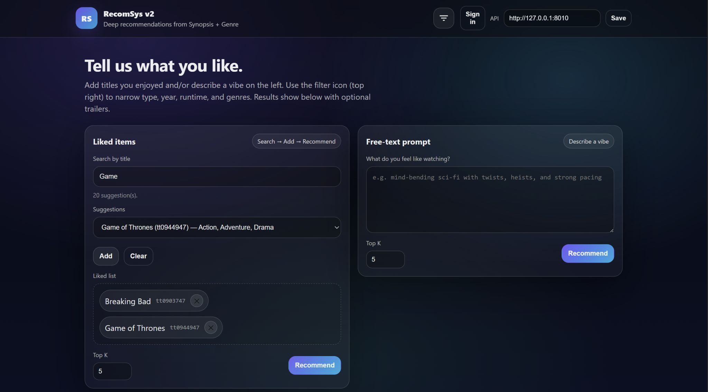
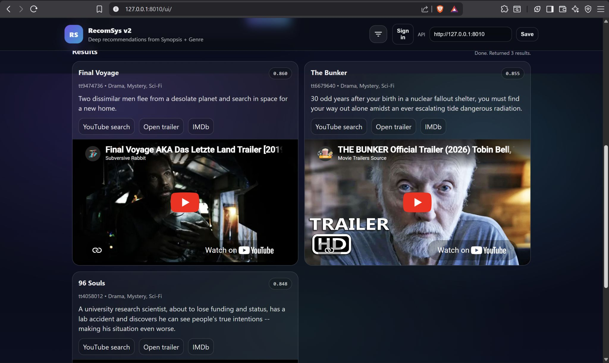

# RecomSys v2

Badges reflect **minimum versions from `requirements.txt`** and the **Docker** base image. They are labels only—nothing to click for magic.

| Area | Tags |
|------|------|
| **Language & runtime** | [](https://www.python.org/) [](https://www.docker.com/) |
| **Web & API** | [](https://fastapi.tiangolo.com/) [](https://www.uvicorn.org/) [](https://docs.pydantic.dev/) |
| **ML & numerics** | [](https://pytorch.org/) [](https://pytorch.org/) [](https://www.sbert.net/) [](https://scikit-learn.org/) [](https://numpy.org/) [](https://pandas.pydata.org/) |
| **Auth & persistence** | [](https://www.sqlite.org/) [](https://passlib.readthedocs.io/) [](https://python-jose.readthedocs.io/) |
| **Media & metadata** | [](https://developers.google.com/youtube/v3) [](https://www.themoviedb.org/documentation/api) |
| **Extra UI** | [](https://streamlit.io/) |
| **HTTP & tooling** | [](https://requests.readthedocs.io/) [](https://github.com/theskumar/python-dotenv) [](https://tqdm.github.io/) [](https://github.com/Tinche/aiofiles) |
| **Deploy** | [](https://kubernetes.io/) [](https://azure.microsoft.com/) [](https://www.ansible.com/) |

**Pinned model:** `sentence-transformers/all-MiniLM-L6-v2` (title + synopsis embeddings).

---

A small-but-serious movie recommender: you describe a mood (or pick a few liked titles), and it ranks the whole catalog using **synopsis embeddings** plus **genre** signals. No collaborative filtering, no giant user matrix—just text + metadata doing the heavy lifting. There is also a **vanilla JS UI** at `/ui`, optional **Streamlit** front-end, **SQLite** for accounts and shareable runs, and enough **Docker / Kubernetes / Ansible** glue that you can take the same app from your laptop to an Azure cluster without reinventing the wheel.

If you only read one thing: clone it, install deps, point `CATALOG_PATH` at your CSV, run `uvicorn`, open `/ui`, and you are in business.

---

## Screenshots & ops snapshots

**Web UI** (`/ui` served by FastAPI):



**I/O / workflow** (how requests flow through the pieces you run day to day):



**Load testing** (Locust—handy when you tune `top_k`, filters, or cluster size):


**Kubernetes on Azure** (pods sitting on your node pool—your layout may differ, but the idea is the same):


---

## What you get out of the box

- **Semantic + genre ranking** — synopsis goes through MiniLM; genres are multi-hot; vectors are concatenated and cosine-similarity ranked (`recommender/model.py`).
- **Recency re-rank** — optional bump for newer titles so “something from this decade” does not lose to a perfect 1970s match (`recommender/recency_rank.py`).
- **Filters** — kind, year window, runtime, certificate, genres (`/filters/options` + request bodies on recommend routes).
- **Trailers** — YouTube resolver with quota-aware behavior; TMDB resolver for metadata-aware trailer search when configured (`recommender/youtube.py`, `recommender/tmdb.py`).
- **Accounts & share links** — register/login, JWT sessions, persisted recommendation runs with URL-safe slugs (`server/`, `/auth/*`, `/me`, `/share/{slug}`).
- **Static UI + Streamlit** — production-ish HTML UI under `/ui`; `streamlit_app.py` for demos against the same API.
- **Cloud-shaped deploy** — Dockerfile, Kubernetes manifests, Ansible playbook, Azure-oriented notes (`deploy/`, `ansible/`, `deploy/AZURE-K8S.md`).

---

## Repository layout (the short tour)

| Path | Why it exists |
|------|----------------|
| `api.py` | FastAPI application: health, search, recommend, auth, share, static `/ui`. |
| `recommender/` | Catalog loading, recommender, recency, YouTube/TMDB, secrets helpers. |
| `server/` | SQLite schema + JWT/password helpers for auth and saved runs. |
| `frontend/` | Static SPA served at `/ui`. |
| `streamlit_app.py` | Alternate UI that talks to the API over HTTP. |
| `deploy/docker/Dockerfile` | Production-ish container (Python 3.12 slim, single uvicorn worker). |
| `deploy/k8s/*.yaml` | Namespace, PVC, Deployment, Service (+ secret examples). |
| `ansible/playbook.yml` | Idempotent `kubectl apply` from any host with kubeconfig. |
| `export_bundle.py` / `update_catalog_tmdb.py` | Data prep / TMDB enrichment helpers. |
| `catalog_meta.csv` | Your catalog (large file—treat as data, not hand-edited lore). |

---

## Quick start (local)

**1. Python environment**

```bash
python -m venv .venv
.\.venv\Scripts\activate          # Windows
# source .venv/bin/activate       # macOS / Linux
pip install -r requirements.txt
```

**2. Environment variables** (only the ones you truly need)

| Variable | Purpose |
|----------|---------|
| `CATALOG_PATH` | Path to `catalog_meta.csv` (default: file in repo root). |
| `CACHE_PATH` | Where the item matrix cache is written (default `.cache/item_matrix.npy`). |
| `DB_PATH` | SQLite file for users + runs (default `.data/recomsys.db` under repo root). |
| `JWT_SECRET` | **Set in production** — signs login tokens (`server/auth.py`). |
| `YOUTUBE_API_KEY` or `YOUTUBE_API_KEY_FILE` | Enables trailer resolution (`recommender/youtube.py`). |
| `TMDB_API_KEY` / related | TMDB trailer + catalog enrichment (`recommender/tmdb.py`, `update_catalog_tmdb.py`). |
| `LIMIT_ROWS` | Optional cap while iterating on a huge CSV. |
| `FORCE_REBUILD_MATRIX` | `true` to ignore cache and rebuild embeddings matrix. |

**3. Run the API**

```bash
uvicorn api:app --host 127.0.0.1 --port 8010 --reload
```

Then open **`http://127.0.0.1:8010/ui/`** (or whatever port you picked). Health check: **`http://127.0.0.1:8010/health`**.

**4. Streamlit (optional)**

```bash
set API_URL=http://127.0.0.1:8010        # Windows cmd
$env:API_URL="http://127.0.0.1:8010"    # PowerShell
streamlit run streamlit_app.py
```

---

## How recommendations work (human version)

1. **Catalog load** — `recommender/data.py` reads your CSV into a `Catalog` with titles, synopses, genres, years, etc.
2. **Item matrix** — `Recommender.build_item_matrix` embeds each title+synopsis with SentenceTransformers, builds a genre vector, concatenates, L2-normalizes. Result is cached to disk so the second boot is not a science project.
3. **Query path** — your natural-language query is embedded the same way; cosine similarity against all items yields a ranked list. Filters shrink the dataframe first so you are not ranking rows you already threw away.
4. **Liked path** — seed titles/IMDb IDs map to row indices; the recommender blends those seeds the same way as the query path.
5. **Recency** — optional second pass reshuffles the top pool so newer releases can bubble up when that is what you want.
6. **Trailers** — after the list is final, each row gets a YouTube (and/or TMDB-aware) lookup for embed links.

If anything feels slow the first time, it is almost always the **matrix build** or **model download**—grab coffee once, then it is cached.

---

## Docker

```bash
docker build -f deploy/docker/Dockerfile -t recomsys:local .
docker run --rm -p 8000:8000 ^
  -e JWT_SECRET=change-me ^
  -e YOUTUBE_API_KEY=optional ^
  recomsys:local
```

Mount a volume at `/data` if you override `DB_PATH` / `CACHE_PATH` to live there (matches the Kubernetes manifests).

---

## Kubernetes & Azure

See **`deploy/AZURE-K8S.md`** for the opinionated walkthrough (ACR build, `kubectl apply`, node sizes). The manifests live in **`deploy/k8s/`**; **`ansible/playbook.yml`** is the “I already have kubeconfig” button.

---

## Load testing

The Locust screenshots above are from hammering `/recommend/query` and friends while tuning concurrency. Keep an eye on RAM: each worker process loads the transformer and matrix—horizontal scaling wants smaller catalogs or shared artifact stores.

---

## License / contributing

This README is descriptive, not legal advice. If you fork the project, swap badges, point `CATALOG_PATH` at data you are allowed to ship, and rotate `JWT_SECRET` before exposing anything to the internet.

---

**Built for people who like movies, vectors, and not overthinking the first deploy.** Enjoy.
